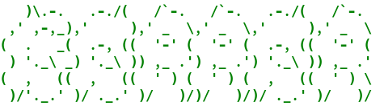

[](https://github.com/acidghost/gorror/actions/workflows/ci.yml)

Easily generate Go error structures starting from string templates.

## Installation

Simply: `go install github.com/acidghost/gorror@latest`.

## Usage

In the simplest scenario you would invoke Gorror through `go generate`. In the
following example we declare two error specifications, `ErrOpen` and `ErrRead`.
These have type `MyErr`, which is a type alias for `string` that allows to tag
strings as error templates.

```go
package mypackage

import "errors"

type MyErr string

//go:generate gorror -type=MyErr

const (
	ErrOpen = MyErr("failed to open {{file string %q}}")
	ErrRead = MyErr("nowrap:failed to read from {{file string %q}} (code={{code uint %d}})")
)
```

The above code would generate, in a file called `myerr_def.go`, the following code:

```go
// Errors generated by Gorror; DO NOT EDIT.

package mypackage

import (
	"errors"
	"fmt"
)

type _errWrap struct{ cause error }

func (w *_errWrap) Unwrap() error { return w.cause }

func (e MyErr) IsIn(err error) bool {
	var ei interface {
		Is(MyErr) bool
		Unwrap() error
	}
	if errors.As(err, &ei) {
		if ei.Is(e) {
			return true
		}
		return e.IsIn(ei.Unwrap())
	}
	return false
}

type errOpen struct {
	_errWrap
	file string
}

func newErrOpen(file string) *errOpen {
	return &errOpen{_errWrap{nil}, file}
}

func (e *errOpen) Error() string {
	if e.cause == nil {
		return fmt.Sprintf("failed to open %q", e.file)
	}
	return fmt.Sprintf("failed to open %q: %v", e.file, e.cause)
}

func (e *errOpen) Wrap(cause error) error {
	e.cause = cause
	return e
}

func (*errOpen) Is(e MyErr) bool { return e == ErrOpen }

type errRead struct {
	file string
	code uint
}

func newErrRead(file string, code uint) *errRead {
	return &errRead{file, code}
}

func (e *errRead) Error() string {
	return fmt.Sprintf("failed to read from %q (code=%d)", e.file, e.code)
}

func (*errRead) Is(e MyErr) bool { return e == ErrRead }
```
